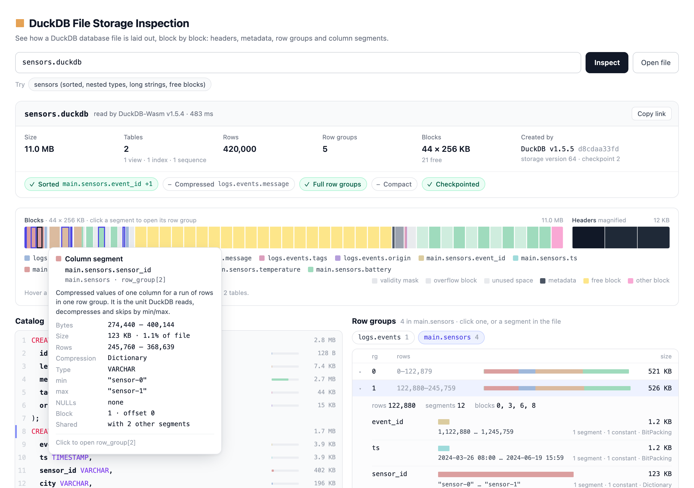
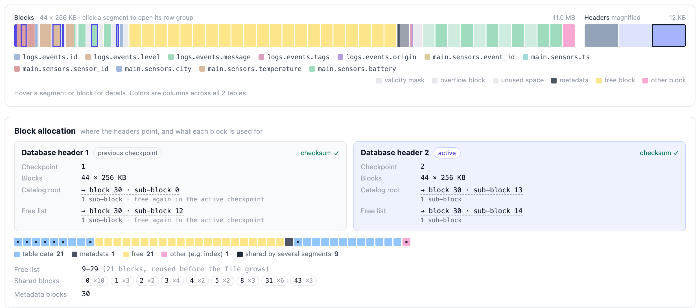
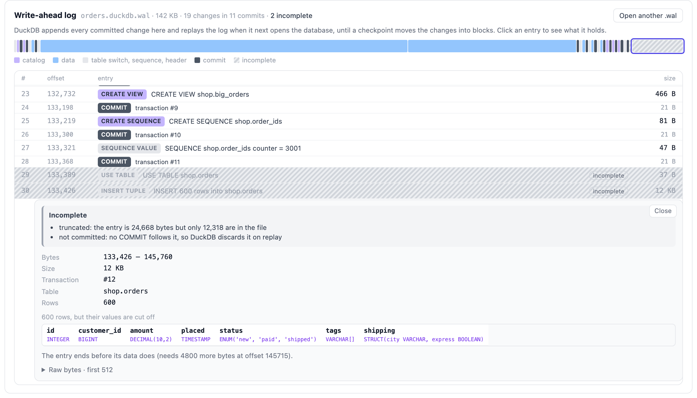
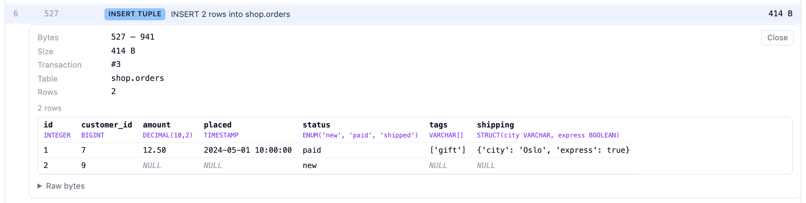

# DuckDB File Storage Inspection

See how a DuckDB database file is laid out on disk: headers, metadata, row groups, column segments, overflow, free and index blocks, and what is still waiting in its write-ahead log. It's modeled on [Parquet X-ray](https://github.com/cfahlgren1/parquet-xray), adapted to DuckDB's storage format.



Type a path on this machine (`~/data/app.duckdb`), or open or drop a file. Only local files are supported, not URLs. The file is attached read-only in [DuckDB-Wasm](https://github.com/duckdb/duckdb-wasm) and read block by block, so large databases aren't loaded into memory whole.

## Usage

You need Node 22.18 or newer.

```sh
npm start                                   # http://localhost:5173, installs dependencies on first run
npm start -- --port 8080                    # another port; PORT=8080 npm start works too
npm start -- ~/data/app.duckdb              # opens that database right away
npm start -- ~/data/app.duckdb --no-open    # prints the link instead of opening a browser
```

`node scripts/start.ts` does the same without npm.

Paths are served by a small route in the dev and preview servers (`server/local-files.ts`) that only serves files starting with DuckDB's magic bytes, plus the `.wal` next to such a file or a lone file that starts like a WAL. It answers only the app itself on this machine: requests from other machines (even with `--host`), with another Host (DNS rebinding) or from another site's page get a 403. **Open file** asks the server to show the system's open-file dialog (`osascript` on macOS, `zenity` or `kdialog` on Linux, PowerShell on Windows) and opens the chosen file by its full path, so its `.wal` is found too. Without that server, or without a dialog program, it falls back to the browser's picker, which, like dropping a file, only gives the page the file's name and contents; pick or drop the `.wal` together with the database to see it.

## What it shows

### File layout

Every 256 KB block in file order, colored by what it holds: column segments per column, validity masks, overflow blocks, metadata, free blocks, index blocks, and unused space at the end of partly filled blocks. The 12 KB of headers are magnified on the right. Hover anything for its byte range and details; click a segment to open its row group, whose columns are listed segment by segment below. The catalog lists every table as `CREATE TABLE`, with each column's size on disk and its min/max per row group.

- **Catalog and segments** come from DuckDB: `duckdb_tables()`, `duckdb_columns()`, `pragma_storage_info()` for where every segment starts and how it is compressed, and `pragma_metadata_info()` for metadata sub-blocks.
- **Segment ends**: `pragma_storage_info` only gives start offsets. A segment ends where the next one in its block starts. The last segment in a block ends at the block's last non-zero byte, since DuckDB zero-fills the rest.

### Block allocation



The two database headers, parsed directly and checked against their checksums: the active one (higher checkpoint number) and the one the next checkpoint will overwrite. Each points to the root of its catalog and to its free list; the viewer follows those pointers through the chain of 4 KB metadata sub-blocks and lists every hop. Hover a pointer, a header or a block to outline it in the file layout. The previous header's pointers show where the last checkpoint's metadata was, and whether the active checkpoint has freed it again.

Below, every block as a square by state (table data, metadata, free, other such as index storage, missing), with blocks shared by several segments dotted, and the free list itself: free block ranges and the segment count of every shared block.

### Write-ahead log



The `.wal` next to the database (the same path with `.wal` appended), parsed directly. Each entry's size and checksum are checked the way DuckDB's replay does, and entries are grouped into transactions by their commits. The strip on top shows every entry by size.

An entry is shown in gray and marked **incomplete** when it is cut off by the end of the file, fails its checksum, comes after a damaged entry, or has no commit after it. DuckDB skips all of these on replay. The block layout shows only checkpointed data; the WAL panel shows what isn't checkpointed yet.

Click an entry to decode it: CREATE/ALTER/DROP statements are rebuilt as SQL, and inserted, updated and deleted rows are shown as a table, with every column's type.



A `.wal` can also be opened on its own, by its path or by picking only it; column names then come only from CREATE TABLE entries in the log.

### Damaged files

A database cut off before its end (a crash while it grew, an interrupted copy) still shows its headers and block layout, with the missing blocks marked. DuckDB can't open such a file, so the summary says why tables aren't shown. [`examples/`](examples) has healthy and damaged databases and WALs to try this on: a database or a WAL on its own, a torn last commit, a torn entry header, a checksum mismatch, a truncated database, a torn database header and a bulk insert. Open one by path, e.g. `npm start -- examples/04_wal_torn_last_commit/store.duckdb`.

## Compatibility

- Checked against files written by DuckDB 1.5.5 (storage version 64), in Chromium, Firefox and WebKit.
- DuckDB-Wasm is pinned to `1.33.1-dev57.0`, a prerelease: it is npm's `latest` tag and the only build that tracks DuckDB 1.5. Move to a stable release once one is published.
- Local paths need `npm start` (the dev server). A static build of `dist/` still opens picked files.

## Not supported

- **Encrypted databases** (`ATTACH ... (ENCRYPTION_KEY ...)`). The viewer can't read their blocks without the key, so it stops after the main header and says the file is encrypted.
- **Encrypted write-ahead logs**, which come with encrypted databases. Only the WAL's version header is shown; its entries can't be framed or decoded.

## Development

```sh
npm run verify        # lint, type-check, build
npm run sample        # rebuild public/sensors.duckdb with the DuckDB CLI
npm run examples      # rebuild examples/ and public/orders.duckdb(.wal) with the DuckDB CLI
npm run screenshots   # regenerate the images in docs/
```

See [CONTRIBUTING.md](CONTRIBUTING.md) for how the code is organized.

## License

[MIT](LICENSE)
